## Table of contents

* [Overview](#overview)
* [User Guide](#user-guide)
* [Community Feedback](#community-feedback)
* [Developer Guide](#developer-guide)
* [Beyond the Basics](#beyond-the-basics)
* [Project Links](#project-links)

## Overview

Rainbow Retail is a web application for UH students, faculty, and staff to buy and sell goods. 

It is designed to be a Craigslist alternative with factors such as:

* Buyers and sellers must be UH students, faculty, or staff. (See “Beyond the Basics” for a way to enforce this.)
* There is no anonymity: buyers and sellers connect through their UH credentials.
* Transactions are expected to occur on-campus. If a seller wants to meet off-campus, that can be a red-flag.
* Because buyers and sellers are from UHM, the goods and services will be relevant to UH students.

Renigma, the organization buidling and maintaining Rainbow Retail, can be found on [Github](https://github.com/renigmaflea)

## User Guide

This section will provide a walkthrough of using Rainbow Retail Flea's user interface and how to start your Flea Market Career.

### Landing Page

The landing page is presented to users when they visit the top-level URL to the site. The slogan, "Cheapest <item name> near you" is animated. The highlighted keyword would change every 3 seconds, signifying the site's wide range of products.

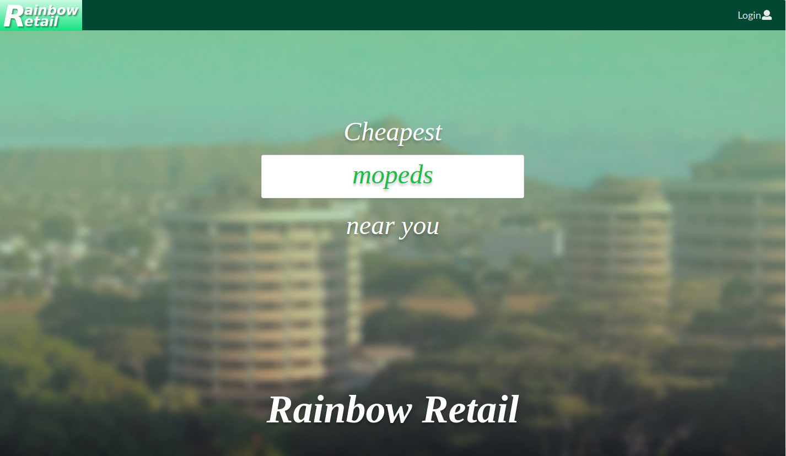

Users are greeted with explanations of the app's features. Carousels are used to continuously change
the screenshots.

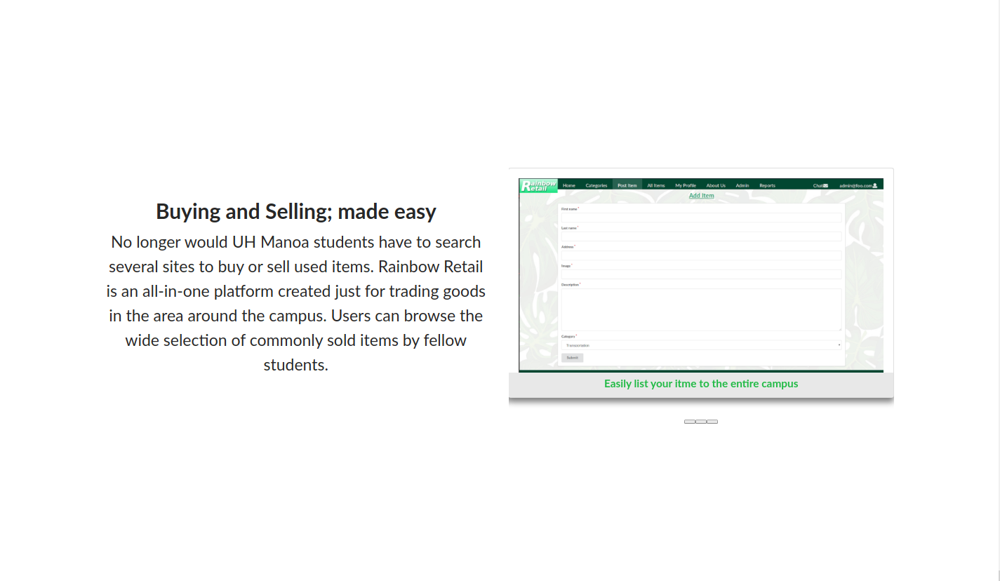

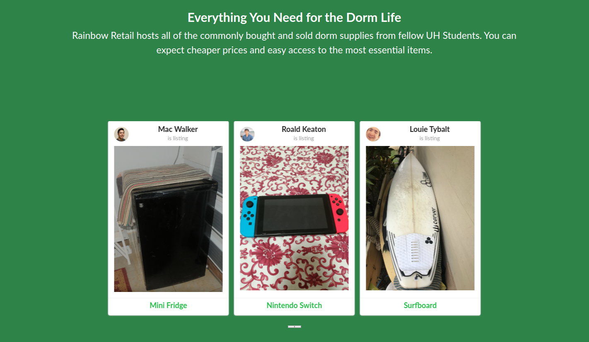

Anonymous users are encouraged to sign up with the site. The button would take new users to the sign
up page.


### Sign in and sign up

Click on the "Login" button in the upper right corner of the navbar, then select "Sign in" to go to the following page and login. You must have been previously registered with the system to use this option:

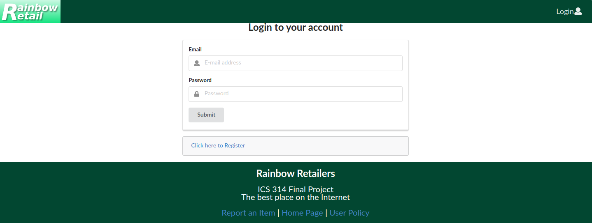

Alternatively, you can select "Sign up" to go to the following page and register as a new user:

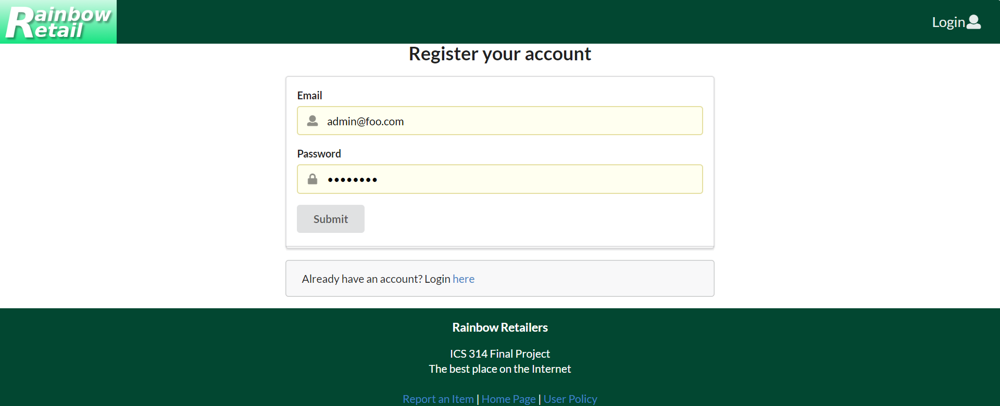


### Add Listings

This page will allow users to add listings for selling.

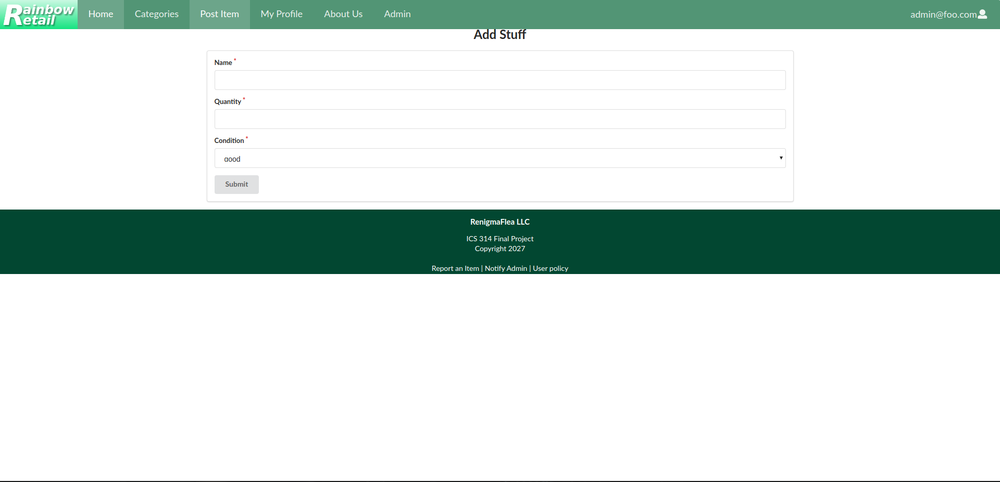

### Listing Page

Users can view the added listings that they had created and other members' listings.

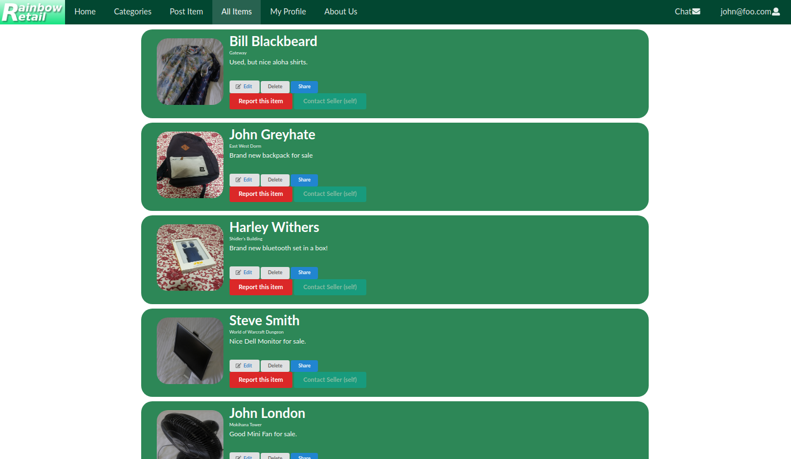

### Categories

Users can browse through categories of items that is commonly bought or sold within the UH Manoa campus.

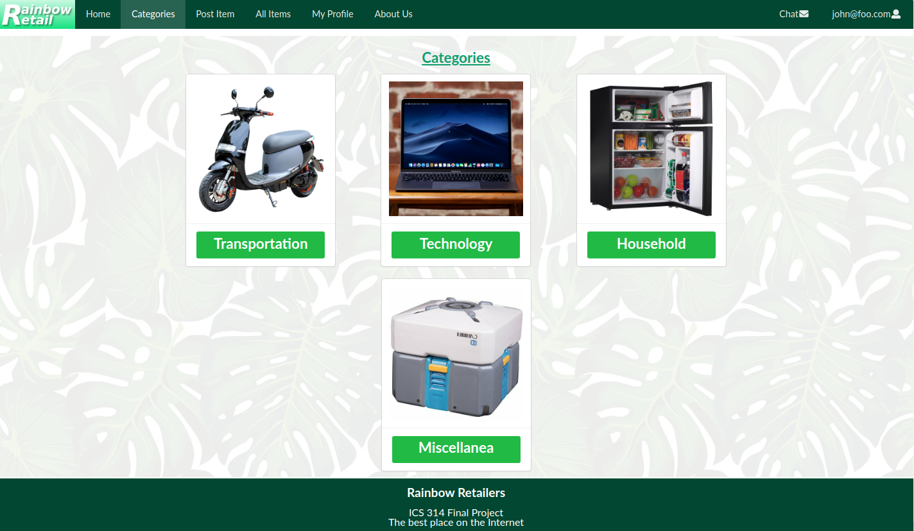

Clicking on a category would display all of the related listings in that category.

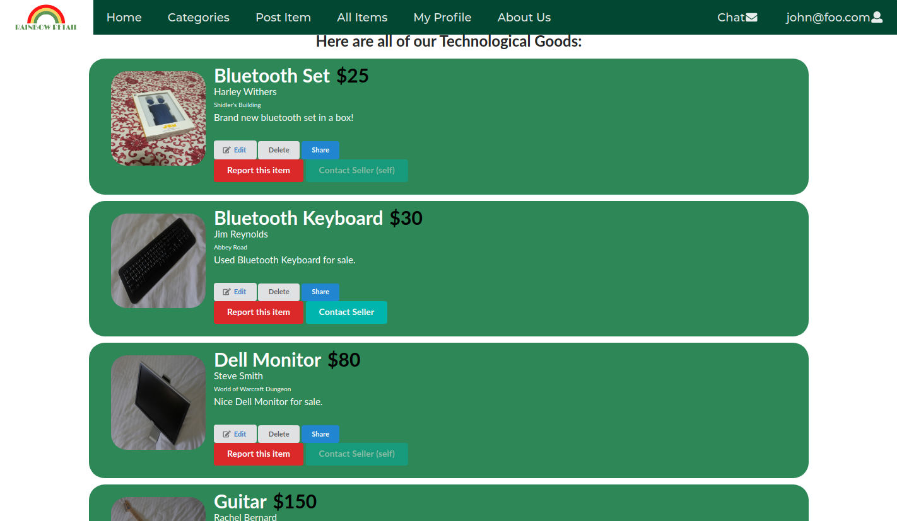

### Profiles Page

Users can search and browse the profiles database and see what items are listed by profiles.

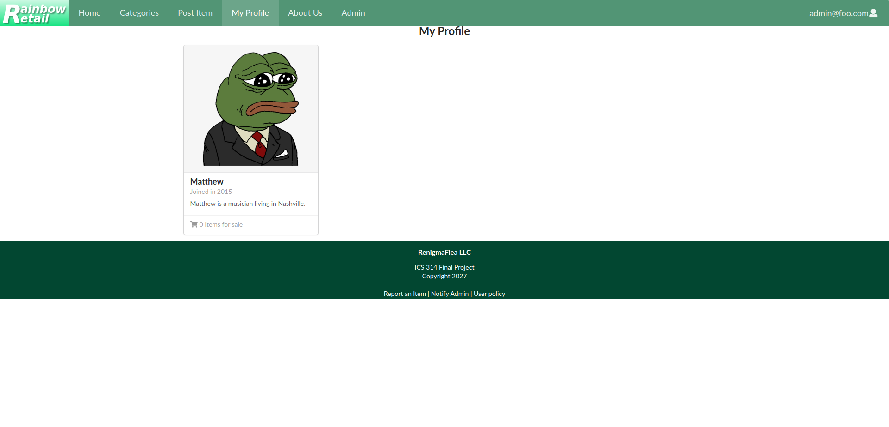

### Private Chat Page

Users can privately send messages to another user with the contact seller button. Each chat will be displayed in the upper right corner of the navigation bar.

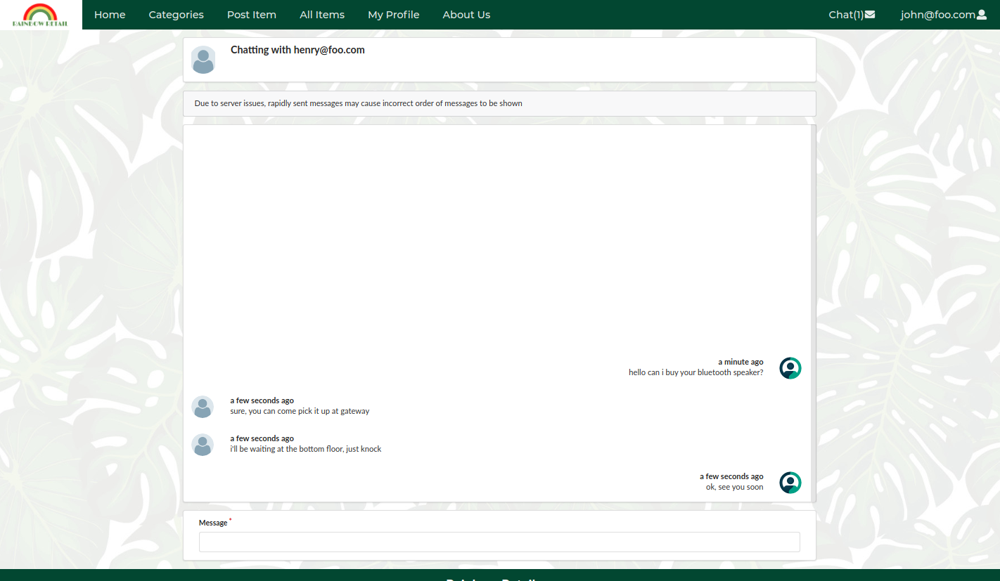

### About Us

Interested in the project and the team? The information about the project can be found in the About Us page.

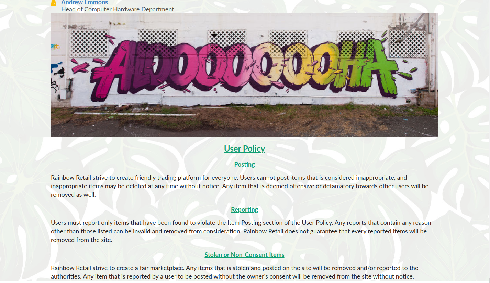

### Admin Page

The admin page is much like the listing page showcasing all the items that have been listed from other users, the admin can delete other user's listings.

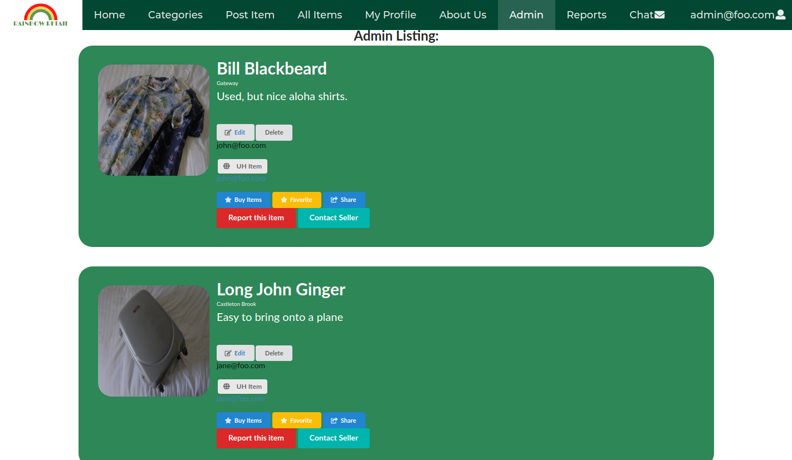

### Report Page

The report age is where all the reported items by users go to. Admins can review the listings and choose to delete from here.

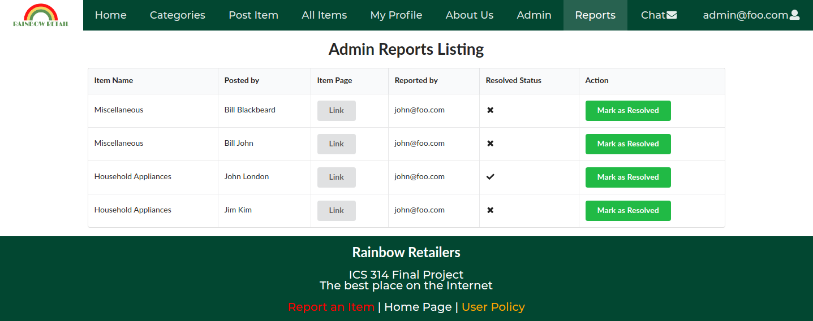

## Community Feedback

We are interested in your experience using Rainbow Retail! You can contact us directly by direct messaging any of our members on [Github](https://github.com/renigmaflea/renigmaflea)

### Team Members
* Patima Poochai
* Justin Wong
* Andrew Edward Emmons
* Dean Fujimoto
* Daniel Florenco

## Developer Guide

This section provides information of interest to Meteor developers wishing to use this code base as a basis for their own development tasks.

### Installation

First, [install Meteor](https://www.meteor.com/install).

Second, visit the [Rainbow Retail application github page](https://github.com/bowfolios/bowfolios), and click the "Use this template" button to create your own repository initialized with a copy of this application. Alternatively, you can download the sources as a zip file or make a fork of the repo.  However you do it, download a copy of the repo to your local computer.

Third, cd into the bowfolios/app directory and install libraries with:

```
$ meteor npm install
```

Fourth, run the system with:

```
$ meteor npm run start
```

If all goes well, the application will appear at [http://localhost:3000](http://localhost:3000).

### Application Design

Rainbow Retail Flea is based upon [meteor-application-template-react](https://ics-software-engineering.github.io/meteor-application-template-react/) and [meteor-example-form-react](https://ics-software-engineering.github.io/meteor-example-form-react/). Please use the videos and documentation at those sites to better acquaint yourself with the basic application design and form processing in Rainbow Retail Flea.

## Initialization

The [config](https://github.com/bowfolios/bowfolios/tree/master/config) directory is intended to hold settings files.  The repository contains one file: [config/settings.development.json](https://github.com/bowfolios/bowfolios/blob/master/config/settings.development.json).

This file contains default definitions for Profiles, Projects, and Interests and the relationships between them. Consult the walkthrough video for more details.

The settings.development.json file contains a field called "loadAssetsFile". It is set to false, but if you change it to true, then the data in the file app/private/data.json will also be loaded.  The code to do this illustrates how to initialize a system when the initial data exceeds the size limitations for the settings file.


## Quality Assurance

### ESLint

BowFolios includes a [.eslintrc](https://github.com/bowfolios/bowfolios/blob/master/app/.eslintrc) file to define the coding style adhered to in this application. You can invoke ESLint from the command line as follows:

```
meteor npm run lint
```

ESLint should run without generating any errors.

It's significantly easier to do development with ESLint integrated directly into your IDE (such as IntelliJ).

## Beyond the Basics

There are a number of simple enhancements you can make to the system to become better acquainted with the codebase:


* A rating system for buyers and sellers.
* Map-based interface to indicate where goods are.
* On-site payment / PCI compliance
* Fixing XSS and common web apps exploits

# Project Links
Github repository:
* [https://github.com/renigmaflea/renigmaflea](https://github.com/renigmaflea/renigmaflea)

Galaxy:
* [http://rainbowretail.meteorapp.com/#/](http://rainbowretail.meteorapp.com/#/)


Milestone 1 page:
* [https://github.com/renigmaflea/renigmaflea/projects/1](https://github.com/renigmaflea/renigmaflea/projects/1)

The goal of this milestone was to create the basic fundamentals of our websites, and showcase what our website will eventually be.

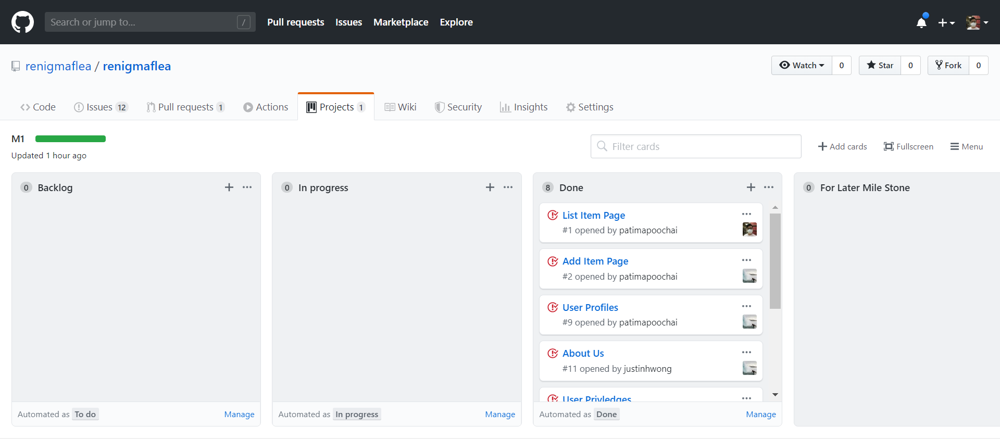

Milestone 2 page:
* [https://github.com/renigmaflea/renigmaflea/projects/2](https://github.com/renigmaflea/renigmaflea/projects/2)

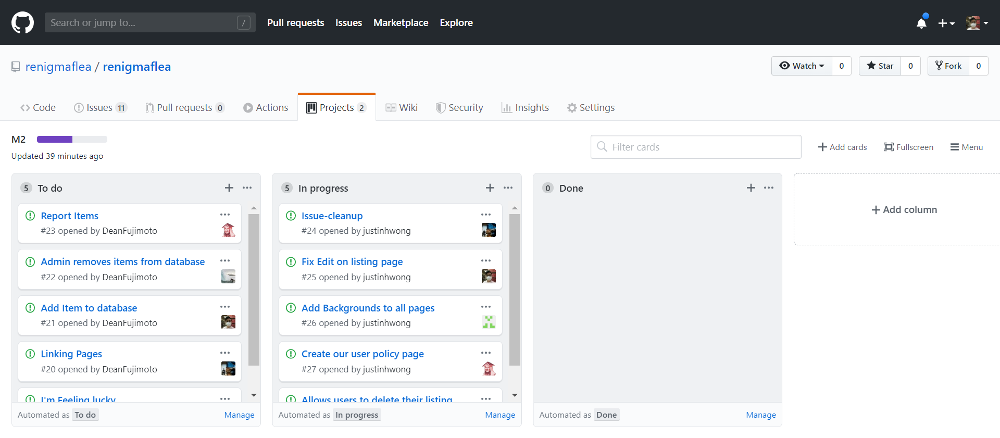

Milestone 3 page:
* [https://github.com/renigmaflea/renigmaflea/projects/3](https://github.com/renigmaflea/renigmaflea/projects/3)

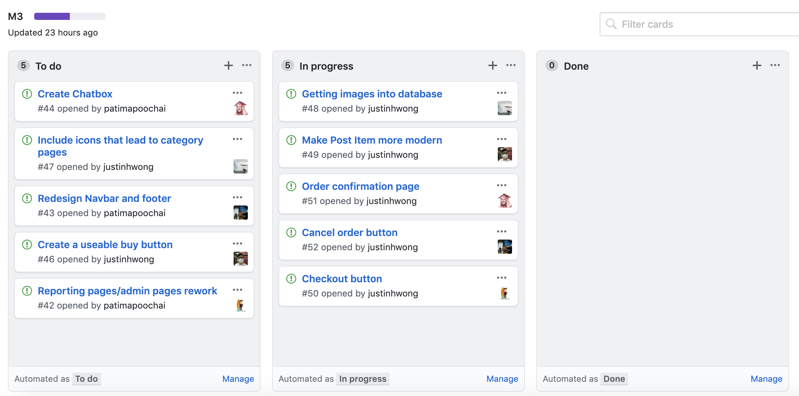


