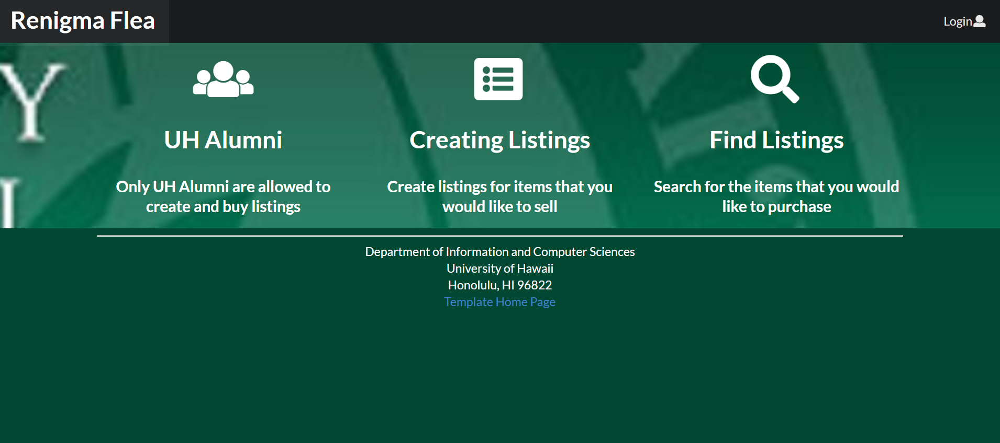
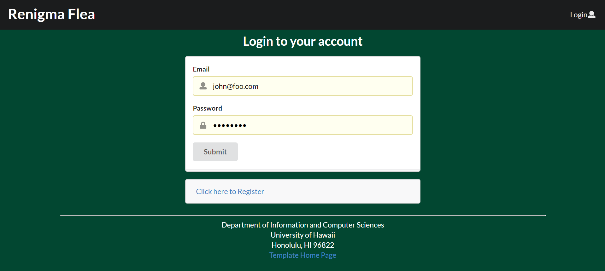
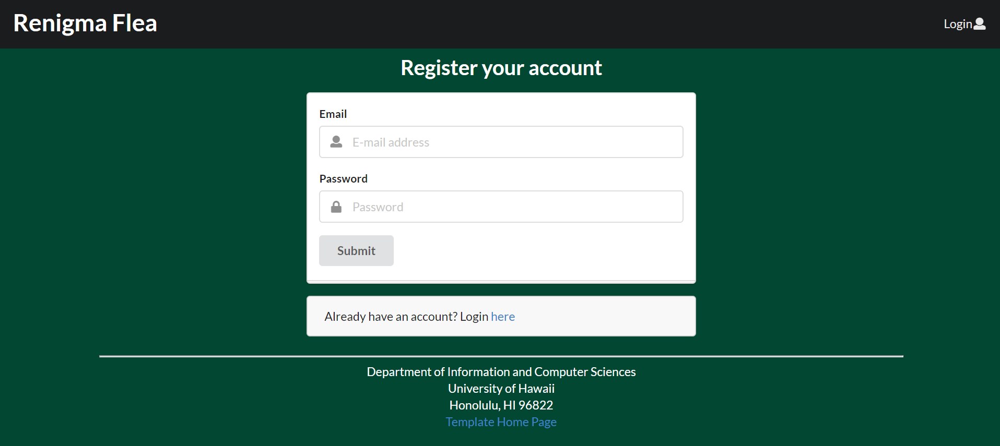
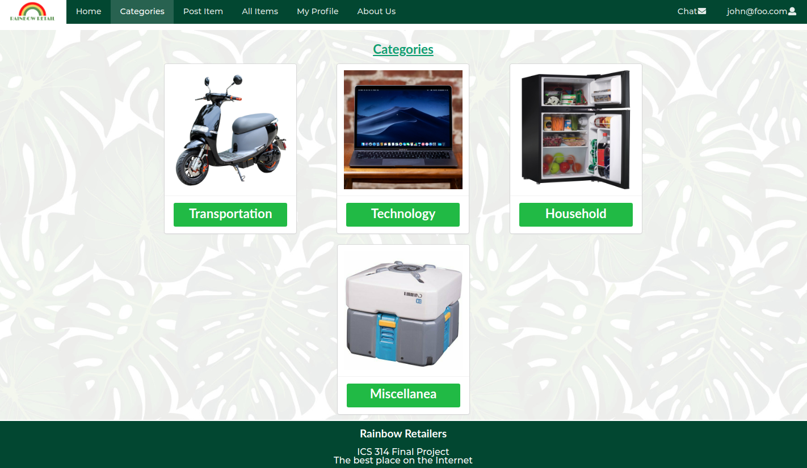
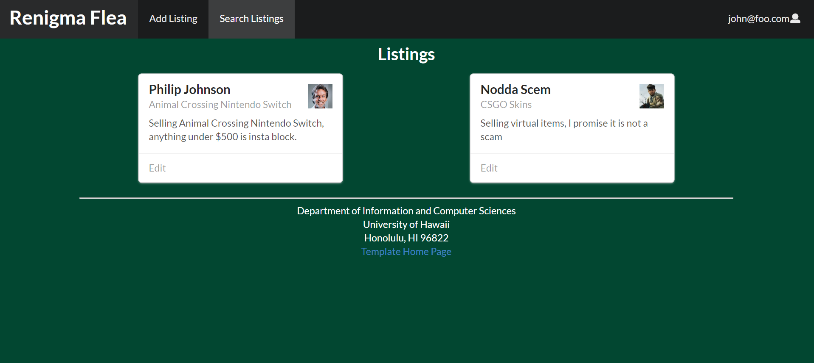
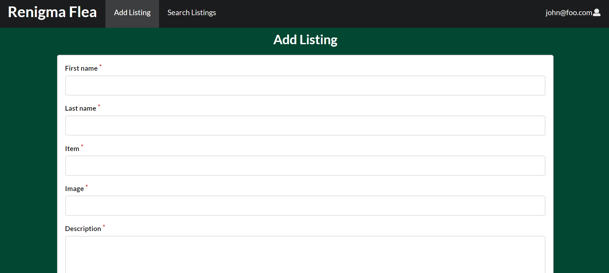

## Table of contents

* [Overview](#overview)
* [User Guide](#user-guide)
* [Community Feedback](#community-feedback)
* [Developer Guide](#developer-guide)
* [Beyond the Basics](#beyond-the-basics)

## Overview

Renigma is a web application for UH students, faculty, and staff to buy and sell goods. 

It is designed to be a Craigslist alternative with factors such as:

* Buyers and sellers must be UH students, faculty, or staff. (See “Beyond the Basics” for a way to enforce this.)
* There is no anonymity: buyers and sellers connect through their UH credentials.
* Transactions are expected to occur on-campus. If a seller wants to meet off-campus, that can be a red-flag.
* Because buyers and sellers are from UHM, the goods and services will be relevant to UH students.

## User Guide

This section will provide a walkthrough of using Renigma Flea's user interface and how to start your Flea Market Career.

### Landing Page

The landing page is presented to users when they visit the top-level URL to the site.




### Sign in and sign up

Click on the "Login" button in the upper right corner of the navbar, then select "Sign in" to go to the following page and login. You must have been previously registered with the system to use this option:



Alternatively, you can select "Sign up" to go to the following page and register as a new user:



### Categories (mock up)

Users can browse through categories of items that is commonly bought or sold within the UH Manoa campus.



### Search For Listings

This page will allow users to search for listings created by fellow Alumni.




### Add Listings

This page will allow users to add listings for selling.



## Community Feedback

We are interested in your experience using Bowfolio! You can contact us directly by direct messaging any of our members on [Github](https://github.com/renigmaflea/renigmaflea)

### Team Members
* Patima Poochai
* Justin Wong
* Andrew Edward Emmons
* Dean Fujimoto
* Daniel Florenco

## Developer Guide

This section provides information of interest to Meteor developers wishing to use this code base as a basis for their own development tasks.

### Installation

First, [install Meteor](https://www.meteor.com/install).

Second, visit the [Bowfolios application github page](https://github.com/bowfolios/bowfolios), and click the "Use this template" button to create your own repository initialized with a copy of this application. Alternatively, you can download the sources as a zip file or make a fork of the repo.  However you do it, download a copy of the repo to your local computer.

Third, cd into the bowfolios/app directory and install libraries with:

```
$ meteor npm install
```

Fourth, run the system with:

```
$ meteor npm run start
```

If all goes well, the application will appear at [http://localhost:3000](http://localhost:3000).

### Application Design

Renigma Flea is based upon [meteor-application-template-react](https://ics-software-engineering.github.io/meteor-application-template-react/) and [meteor-example-form-react](https://ics-software-engineering.github.io/meteor-example-form-react/). Please use the videos and documentation at those sites to better acquaint yourself with the basic application design and form processing in Renigma Flea.

## Initialization

The [config](https://github.com/bowfolios/bowfolios/tree/master/config) directory is intended to hold settings files.  The repository contains one file: [config/settings.development.json](https://github.com/bowfolios/bowfolios/blob/master/config/settings.development.json).

This file contains default definitions for Profiles, Projects, and Interests and the relationships between them. Consult the walkthrough video for more details.

The settings.development.json file contains a field called "loadAssetsFile". It is set to false, but if you change it to true, then the data in the file app/private/data.json will also be loaded.  The code to do this illustrates how to initialize a system when the initial data exceeds the size limitations for the settings file.


## Quality Assurance

### ESLint

BowFolios includes a [.eslintrc](https://github.com/bowfolios/bowfolios/blob/master/app/.eslintrc) file to define the coding style adhered to in this application. You can invoke ESLint from the command line as follows:

```
meteor npm run lint
```

ESLint should run without generating any errors.

It's significantly easier to do development with ESLint integrated directly into your IDE (such as IntelliJ).

## Beyond the Basics

There are a number of simple enhancements you can make to the system to become better acquainted with the codebase:


* A rating system for buyers and sellers.
* Map-based interface to indicate where goods are.
* On-site payment / PCI compliance
* Fixing XSS and common web apps exploits


